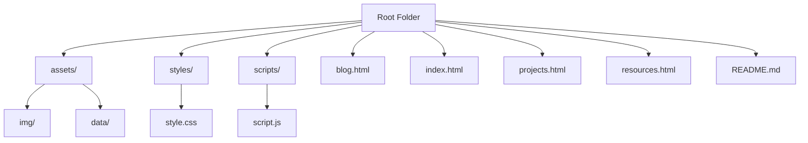

# Project Alpha: Developer Profile Website

A modern, responsive developer profile and portfolio for CIS-376. The site includes:
- About Me: Introduction and background
- Blog: Certifications and school history
- Projects: Interactive cards for completed projects
- Resources: Useful links and references for web development

## Live Site
[View the Developer Profile App](https://jcalvert22.github.io/Project-Alpha/)

## Page Map
- Home: About Me and introduction
- Blog: Certifications and school background
- Projects: Display of completed projects
- Resources: Links and references for web development

## Starter Template
[Front-End Starter Template](starter-template.md) – Use this template to quickly start new web projects with a modern structure.

## Technologies Used
- HTML5, CSS3, JavaScript (ES6)
- Bootstrap 5 (layout, cards, navigation)
- Normalize.css
- Google Fonts
- Bootstrap Icons
- jQuery
- GitHub Pages (hosting/deployment)
- GitHub Copilot (AI code assistance)
- VS Code, browser dev tools
- W3Schools (reference)

## Code Example
```html
<nav class="navbar navbar-expand-lg navbar-light bg-light">
  <a class="navbar-brand" href="index.html">Jace's Developer Page</a>
</nav>
```


## Performance Optimization Notes

- For best results, convert images to WebP and use  srcset for responsive delivery.
- Set cache-control headers for static assets (images, CSS, JS) in your hosting/CDN for longer cache lifetimes.
- All scripts use defer for non-blocking load.
- Font-display: swap is set for Google Fonts.

## Documentation & Wiki

- [Project Wiki (Knowledge Reflection, Templates, Docs)](https://github.com/jcalvert22/Project-Alpha/wiki)

## Project Structure Schematic



## Project Architecture Schematic

```mermaid
flowchart LR
    VSCode[VS Code (Local)] -->|upload| GitHub[GitHub Repository]
    GitHub -->|source| Cloud[Cloud Hosting]
    Cloud -->|styles/pages| APP[App]
    APP --> UI[User Interface]
    UI --> CDN[CDNs]
    CDN -->|BS5, icon, nav, zeromd| UI
```

**Explanation:**
- Code is developed locally in VS Code and uploaded to GitHub.
- GitHub hosts the source code, which is deployed to a cloud host (GitHub Pages).
- The app serves the UI, which loads assets and libraries from CDNs (Bootstrap, icons, Normalize, zero-md).
- The UI is rendered for the user in the browser.
